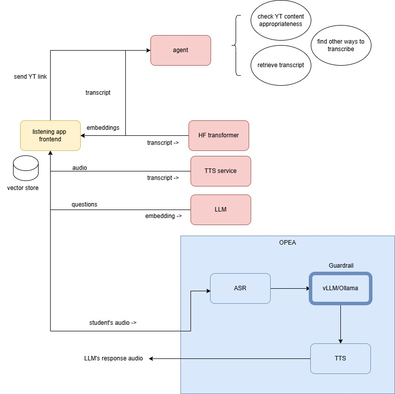

### Overview

This project is designed to enhance listening comprehension skills using Youtube resources and interactive exercises. 

### Architecture

*The OPEA megaservice and the agentic transcriber are separate projects*

#### Components
1. Transcript pulled from a Youtube video using youtube transcript API
   - User is presented with 2 prepared transcripts (topics) and is allowed to enter a Youtube link of their choice. 
   - Agent will check if the video is in Malay (only Malay language is allowed), if it is it will try to get the transcript, if the transcript is not available (TBD). Agent will also check if the content is appropriate.
   - Guardrail will check the transcript content to determine whether it is suitable as a learning material (no profanity, sensitive topics, etc)
   - If everything is good, we will proceed.
2. TTS service will be called to generate the audio from the transcript. At the moment, we are using ElevenLabs

#### Technical Uncertainty
1. Embeddings for the questions to be updated if there are new questions or modifications
2. ASR for the students' response and feedback from LLM
3. Semantic search
4. Using HuggingFace to get embeddings for the transcript and storing them in chromadb as the vector store
### In progress
- Agentic workflows to approve Youtube content and search for transcript (default is using Youtube API)

#### OPEA components
- A megaservice that responds to audio input from students with audio (ASR->vLLM/Ollama->TTS)

